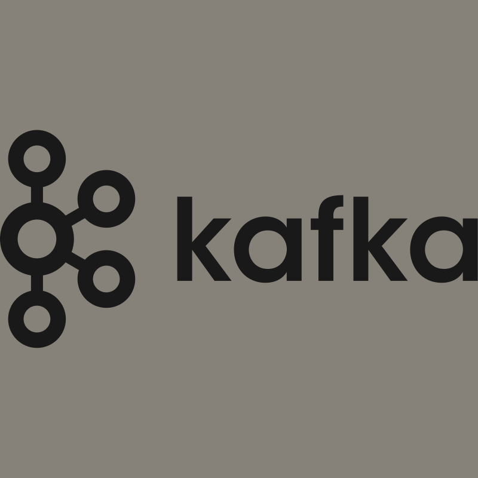
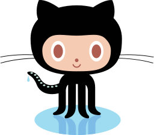

# 👋 Hi, I'm Sumit Gautam a.k.a DevOpsPro

I'm a passionate DevOps Engineer from India with over 3 years of experience specializing in cloud infrastructure, CI/CD automation, and container orchestration. Available for freelance projects and cloud-native collaborations.

## 🚀 Schedule a 1-on-1 Call:
Feel free to [book a call](mailto:sumitgautam579@gmail.com) for consulting or project discussions!

## 💻 Languages & Tools
I work with DevOps, Cloud, Microservices, Containers, and everything in between.

### 🖥️ Programming Language Stack

### 🛠️ OS Stack

### 📚 Database & Messaging

### 🔧 DevOps & CI/CD

### 📋 Project Management

## 📬 Connect with me:
- 💬 Ask me anything about DevOps!
- 📫 Email: [sumitgautam579@gmail.com](mailto:sumitgautam579@gmail.com)
- 🔗 LinkedIn: [Sumit Gautam](https://www.linkedin.com/in/sumitgautam95783)

⚡ **Fun Fact:** I automate everything that can be automated!
